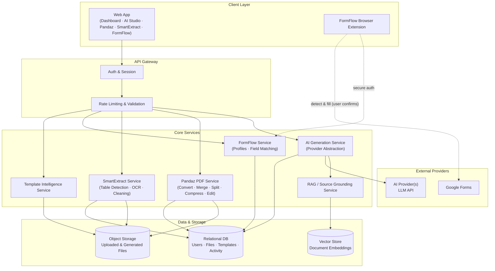
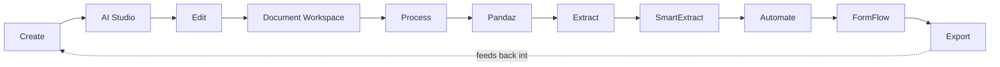
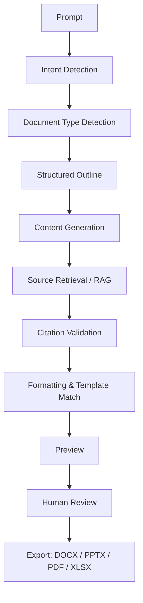
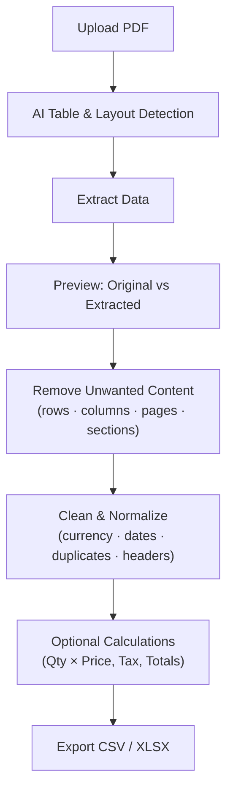
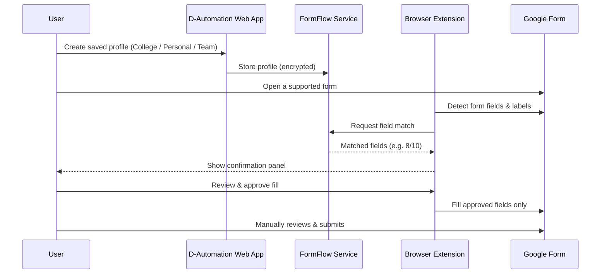
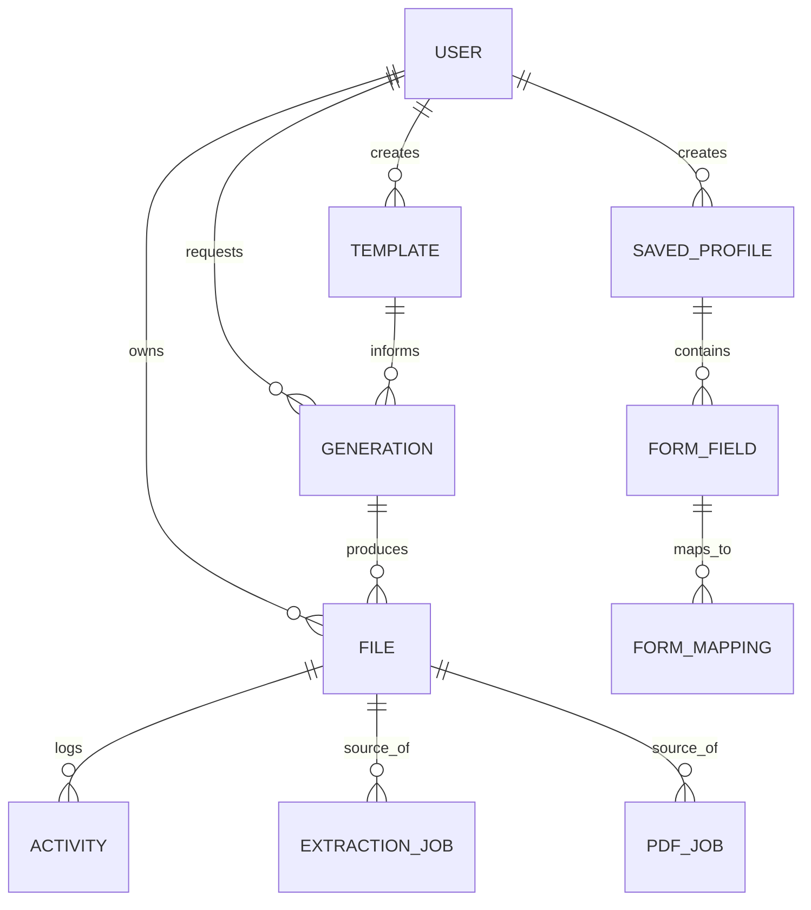

<div align="center">

# D-Automation

### AI-Powered Documents. PDFs. Data. Automation.

**One workspace to create, edit, convert, extract, and automate — from prompt to polished file.**

[](#-roadmap)
[](#-license)
[](#-contributing)
[](#-tech-stack)

[Overview](#-overview) •
[Features](#-key-features) •
[Architecture](#-architecture) •
[SmartExtract](#-smartextract) •
[FormFlow](#-formflow) •
[Getting Started](#-getting-started) •
[Roadmap](#-roadmap) •
[Team](#-developers)

</div>

---

## 📖 Overview

Most tools solve one piece of the document problem. One app generates slides. Another converts PDFs. Another autofills forms. Switching between them breaks your workflow and scatters your files across five different tabs.

**D-Automation** puts all of it in one place: one design system, one file workspace, one AI layer, one history — so creating a document, cleaning up a PDF, pulling data out of an invoice, and filling a repetitive form all feel like the same product instead of four unrelated ones.

## ❗ The Problem

- AI writing tools generate content but don't help you **process** existing documents.
- PDF tools convert and edit files but have **no AI layer** and no memory of your work.
- Business teams manually copy data out of bills and invoices into spreadsheets, again and again.
- Students and job-seekers **retype the same information** into form after form.

## ✅ The Solution

A single, unified productivity platform built around one loop:

```
CREATE → EDIT → CONVERT → EXTRACT → AUTOMATE → EXPORT
```

Everything — AI generation, PDF processing, data extraction, and form automation — shares the same files, the same history, and the same interface.

---

## ⭐ Key Features

| Module | What it does |
|---|---|
| 🧠 **AI Studio** | Turn a single prompt into a polished DOCX, PPTX, PDF, or XLSX — reports, proposals, research papers, patent drafts, and more |
| 📄 **Pandaz PDF Suite** | A full PDF toolkit: merge, split, compress, rotate, edit, convert, and secure — all inside D-Automation |
| 🧾 **SmartExtract** | Turn messy business PDFs (invoices, bills, statements) into clean, exportable data |
| 🔁 **FormFlow** | Save your reused information once, then fill repetitive Google Forms with a reviewed, one-click match |
| 🎨 **Template Intelligence** | Upload a college/company template once — every future document inherits its fonts, structure, and branding |
| 🗂️ **Unified Workspace** | One file manager, one activity history, and one contextual AI assistant across every module |

---

## 🏗 Architecture

D-Automation is built as a modular platform: a single web application shell around independent service modules, each with a clean boundary so they can be developed, scaled, and swapped independently.



### Core product loop



### AI generation pipeline

Every AI request moves through a visible, structured pipeline rather than being dumped straight into a file — this is what makes generated output feel deliberate instead of random.



---

## 🧾 SmartExtract

> **Turn messy business PDFs into clean data.**

Built for invoices, bills, and statements — the workflow detects tables, lets you strip out anything you don't need, cleans what's left, and exports a business-ready file.



**Business Bill Mode** prioritizes invoice-style extraction — item rows, quantities, unit prices, tax, and totals — while ignoring page noise like footers and ads.

---

## 🔁 FormFlow

> **Stop typing the same information again and again.**

FormFlow never touches your Google credentials and never auto-submits anything — it only detects, matches, and fills after you review and confirm.



---

## 🎨 Template Intelligence

Upload a college, company, or institution template (PPTX / DOCX / PDF) once. D-Automation analyzes fonts, colors, spacing, heading hierarchy, margins, and citation style, and stores it as a reusable configuration — so every future generated document inherits the same look automatically.

## 🧰 Pandaz PDF Suite

| Organize | Convert | Optimize | Edit | Security |
|---|---|---|---|---|
| Merge, Split, Reorder, Delete, Extract, Rotate | PDF ⇄ Word / PPT / Excel / CSV / Images | Compress | Text, Highlight, Draw, Shapes, Images, Signatures | Password Protect, Redaction |

*Password unlocking is only performed where legally and technically authorized — D-Automation never claims to bypass encryption on protected documents.*

---

## 🧱 Tech Stack

> D-Automation is architected to be provider-agnostic. The stack below reflects the current build target — swap freely to match what's already in the repository.

| Layer | Technology |
|---|---|
| Frontend | Next.js (React) · TypeScript · Tailwind CSS |
| Backend / API | Node.js · Next.js API Routes / Express |
| AI Layer | Provider-abstracted LLM client (generate · stream · embed · classify · summarize) |
| PDF Processing | Pandaz core (Node/Python PDF libraries) + OCR pipeline |
| Database | PostgreSQL |
| Object Storage | S3-compatible storage |
| Vector Store | For RAG / source grounding |
| Browser Extension | Chrome/Edge extension (FormFlow) |
| Auth | Session-based auth with signed, scoped file access |

---

## 🗃 Data Model (high level)



---

## 🚀 Getting Started

```bash
# 1. Clone the repository
git clone https://github.com/Devengoyal885/D-Automation.git
cd D-Automation

# 2. Install dependencies
npm install

# 3. Configure environment variables
cp .env.example .env

# 4. Run the development server
npm run dev
```

The app will be available at `http://localhost:3000`.

### Environment Variables

```env
# AI Provider
AI_PROVIDER_API_KEY=

# Database
DATABASE_URL=

# Object Storage
STORAGE_BUCKET=
STORAGE_ACCESS_KEY=
STORAGE_SECRET_KEY=

# Auth
AUTH_SECRET=

# FormFlow Extension
FORMFLOW_SERVICE_URL=
```

> Never commit real secrets. All AI calls are made **server-side only** — no API keys are ever exposed to the client.

---

## 🔐 Security

- Authentication & authorization on every route
- Signed, time-scoped download URLs for stored files
- Upload size limits and strict MIME validation
- Rate limiting on AI and processing endpoints
- No secrets in client-side code
- FormFlow stores profile data encrypted, never Google credentials, and never auto-submits a form

## 🗺 Roadmap

**Now**
- [x] Dashboard, AI Studio, Pandaz core, SmartExtract, unified file manager
- [x] Template Intelligence (MVP)
- [x] FormFlow architecture (web app + extension boundary)

**Next**
- [ ] RAG-grounded citations end-to-end
- [ ] Full in-editor AI commands (rewrite, expand, summarize)
- [ ] Business Bill Mode calculations (formulas, totals)

**Later**
- [ ] Team workspaces & collaboration
- [ ] Subscription tiers (Free / Pro / Team / Enterprise)
- [ ] Public API / marketplace

## ⚠️ Responsible AI

- AI-generated research, reports, and patent drafts are labeled **AI-generated draft — review before submission**, never as guaranteed-correct.
- Citations are only shown when a source was actually retrieved — nothing is fabricated.
- SmartExtract's calculation layer is a data-processing convenience, **not accounting or tax advice**.

## 🤝 Contributing

Issues and pull requests are welcome. Please open an issue first for major changes so we can discuss direction before you invest time in a PR.

## 👨‍💻 Developers

<div align="center">

| | | |
|:---:|:---:|:---:|
| **Deven Goyal** | **Rishabh Verma** | **Aditya Singh** |
| [Devengoyal.netlify.app](https://devengoyal.netlify.app) | Developer | Developer |

</div>

## 📄 License

Released under the [MIT License](LICENSE).

---

<div align="center">

**Create once. Process anywhere. Automate repetitive work.**

</div>
